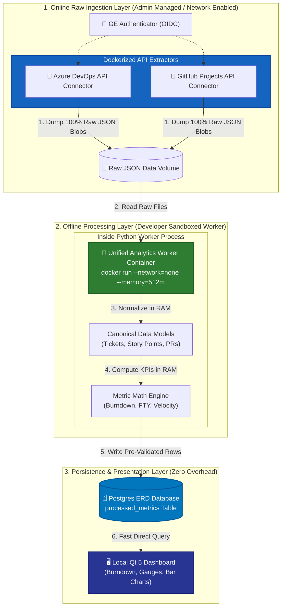
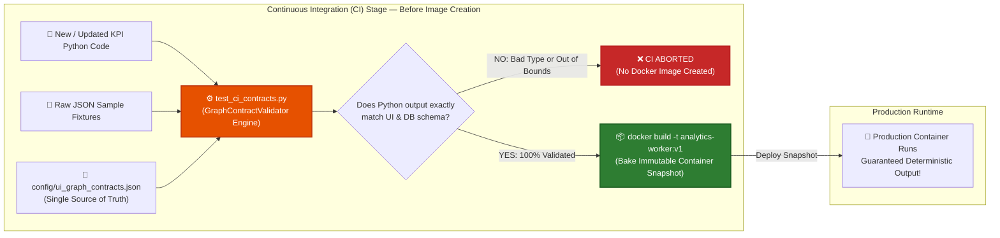
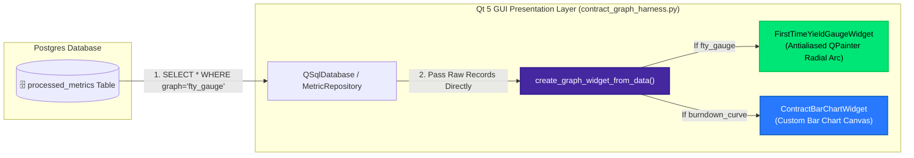

# DMS Architecture & Immutable Docker CI Pipeline
**Project:** Daily Management System (DMS) / Dashboard Testing  
**Team:** LSE 2026 Team 2 - Systems Tools  
**Last Updated:** July 2026  

---

## Executive Summary
The Daily Management System (DMS) utilizes a **Layered Modular Architecture** that strictly decouples online data extraction, offline mathematical computation, and local GUI presentation. 

By enforcing an **Immutable Docker CI Gatekeeper** (`GraphContractValidator`), the system ensures that every metric calculation is rigorously verified offline before its container image (`analytics-worker:v1`) is baked. This guarantees **zero runtime validation overhead** inside the Qt 5 GUI and absolute data integrity inside the Postgres database.

---

## 1. End-to-End 3-Layer Architecture

Our system splits the data lifecycle into three distinct, secure boundaries:
1. **Online Raw Ingestion (Admin Controlled):** Network-enabled containers fetch 100% raw JSON payloads from Azure DevOps and GitHub Projects using OIDC authentication. End users never modify these containers.
2. **Offline Processing (Developer Sandboxed Worker):** A single unified Python container (`--network=none`, `--memory=512m`) loads raw JSON files, normalizes different vendor schemas into canonical models in RAM, computes KPIs (Burndown, First Time Yield, Velocity), and writes the final processed records directly to Postgres.
3. **Persistence & Presentation (Zero Overhead):** The local Qt 5 GUI queries the Postgres `processed_metrics` table and directly instantiates custom-drawn `QWidget` charts without runtime validation loops.



---

## 2. The Immutable Docker CI Gatekeeper

We do not test or validate schemas dynamically inside the Qt GUI widgets on every load. Instead, we follow the **"Test ONCE at the Gate -> Bake Immutable Image"** design pattern.

When a developer adds a new KPI calculation (`compute_new_metric.py`), our automated CI pipeline executes `test_ci_contracts.py` alongside `GraphContractValidator`. It checks the output against `config/ui_graph_contracts.json`. If the output matches exact field names and numeric bounds (`min_value: 0.0, max_value: 100.0`), the Docker image (`analytics-worker:v1`) is created. If it fails, the build is aborted immediately.



---

## 3. Pure Direct Qt GUI Rendering Flow

Because the CI Gatekeeper guarantees that no invalid data can ever be written by `analytics-worker:v1`, the presentation layer (`contract_graph_harness.py`) operates with complete confidence and maximum speed. 

When `create_graph_widget_from_data(graph_key, raw_data)` is called, it directly passes database records into high-performance, antialiased custom widgets (`FirstTimeYieldGaugeWidget`, `ContractBarChartWidget`).



---

## 4. The 3 Golden Contracts

To add new features or KPI plugins in minutes without breaking existing workflows, all components must adhere to three core contracts:

### A. Input Contract (`test_fixtures/`)
Static snapshot JSON files representing real raw outputs from Azure DevOps (`raw_azure_sample.json`) and GitHub Projects (`raw_github_sample.json`). These provide deterministic inputs for local testing and CI verification.

### B. UI Graph Contract (`config/ui_graph_contracts.json`)
The single source of truth defining exact required fields, data types, and value bounds for each Qt graph.
```json
{
  "graphs": {
    "burndown_curve": {
      "type": "xy_line_chart",
      "required_fields": [
        { "name": "date", "type": "string_iso8601" },
        { "name": "remaining_points", "type": "float", "min_value": 0.0 },
        { "name": "ideal_points", "type": "float", "min_value": 0.0 }
      ]
    },
    "first_time_yield_gauge": {
      "type": "gauge",
      "required_fields": [
        { "name": "fty_percentage", "type": "float", "min_value": 0.0, "max_value": 100.0 }
      ]
    }
  }
}
```

### C. DB Schema Contract (`processed_metrics` Table)
The relational schema in Postgres where the Python analytics worker inserts final metric rows:
* `ticket_id` (VARCHAR NOT NULL)
* `metric_name` (VARCHAR NOT NULL)
* `metric_value` (FLOAT NOT NULL)
* `category_label` (VARCHAR)
* `timestamp` (TIMESTAMPTZ NOT NULL)

---

## 5. Developer Workflow: Adding a New KPI Plugin

To implement a new dashboard graph or metric (e.g., **Code Review Turnaround Time**):
1. **Define the Requirement:** Add the expected graph schema to `config/ui_graph_contracts.json`.
2. **Write the Math:** Create `compute_cr_turnaround(tickets: List[Ticket]) -> Dict[str, Any]` inside the unified Python analytics worker code.
3. **Run CI Verification:** Run `python test_ci_contracts.py`. The script feeds sample raw JSON to your function and validates the output against `ui_graph_contracts.json`.
4. **Bake & Deploy:** Once CI passes `[SUCCESS]`, run `docker build -t analytics-worker:latest .`. The new metric is now live and ready to be consumed by the Qt GUI with zero runtime harness overhead!
