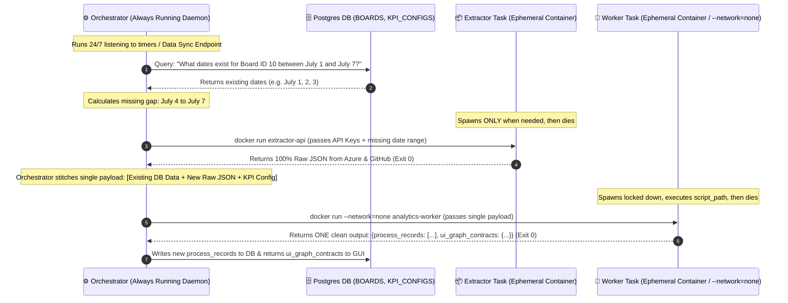
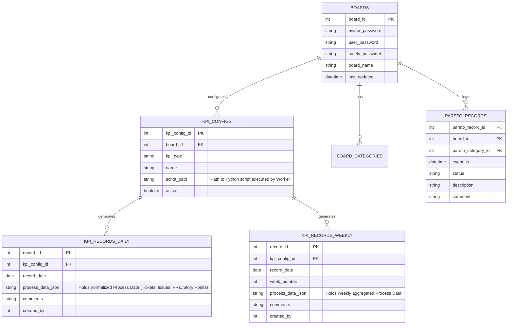
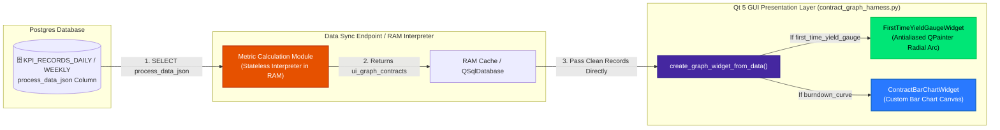

# DMS Architecture & Immutable Docker CI Pipeline
**Project:** Daily Management System (DMS) / Dashboard Testing  
**Team:** LSE 2026 Team 2 - Systems Tools  
**Last Updated:** July 2026  

---

## Executive Summary
The Daily Management System (DMS) utilizes a **Persistent Orchestrator + Ephemeral Task Worker Architecture** that cleanly separates online network extraction, offline mathematical interpretation, and local GUI presentation.

Key architectural foundations:
1. **Persistent Conductor vs. Ephemeral Tasks:** The `Docker worker orchestrator` runs continuously (`24/7`) in the background. It checks the database for missing date ranges and calls short-lived Docker containers (`Extractor` and `Analytics Worker`) into action (`docker run -> execute -> die`).
2. **Facts vs. Interpretation:** The Postgres database stores **Process Data (Historical Facts)** like normalized Tickets, Issues, PRs, and Story Points. The **Metric Calculation Module acts as an Interpreter** that derives views (`ui_graph_contracts`) on the fly, avoiding rigid table mutations whenever KPI formulas change.
3. **Immutable CI Gatekeeper:** Before any analytics worker container is built (`analytics-worker:v1`), `GraphContractValidator` verifies offline that the output strictly conforms to `config/ui_graph_contracts.json` and the `KPI_RECORDS_DAILY` schema.

---

## 1. Conductor & Ephemeral Tasks Lifecycle

Because `Docker worker orchestrator` runs constantly as a daemon/cron service, it performs all lightweight data stitching (`Indexer` role) directly in memory without extra intermediate containers or disk I/O.



---

## 2. SQL Gap Detection: How Needed Records Are Identified

To avoid pulling months of duplicate data from Azure DevOps and GitHub, the Orchestrator performs **SQL Gap Detection** before spawning the Extractor container.

### Step-by-Step SQL Look-Up Example:
Suppose the dashboard requests metrics for **July 1st through July 7th** for Board ID `10`.

#### A. The SQL Query (Asked to Postgres)
The Orchestrator runs a simple `SELECT DISTINCT` check against our `KPI_RECORDS_DAILY` (or `processed_tickets`) table:
```sql
SELECT DISTINCT record_date 
FROM kpi_records_daily 
WHERE board_id = 10 
  AND record_date BETWEEN '2026-07-01' AND '2026-07-07';
```

#### B. The Python Orchestrator Gap Comparison
Postgres returns the dates that **already exist** in our database: `['2026-07-01', '2026-07-02', '2026-07-03']`.
The Orchestrator calculates the difference (`All Requested Dates - Existing Dates`) using simple Python set math:
```python
# All requested dates by the UI
requested_dates = {'2026-07-01', '2026-07-02', '2026-07-03', '2026-07-04', '2026-07-05', '2026-07-06', '2026-07-07'}

# Dates returned by our SQL query above
existing_db_dates = {'2026-07-01', '2026-07-02', '2026-07-03'}

# Set subtraction finds exactly what we need to request from Azure/GitHub!
missing_dates = sorted(list(requested_dates - existing_db_dates))
# Result: ['2026-07-04', '2026-07-05', '2026-07-06', '2026-07-07']
```

#### C. Spawning the Extractor
Now, the Orchestrator only instructs the `Extractor Container` to pull API data for `2026-07-04` through `2026-07-07`. This minimizes network bandwidth and API rate limits.

#### D. Daily Record Overwrite Rule (One Record Per Day / UPSERT)
Our system enforces a strict **One Record Per Day** rule inside `KPI_RECORDS_DAILY`. 
If multiple syncs occur on the exact same calendar day (e.g., at 10:00 AM and again at 4:00 PM on `2026-07-09`), the Orchestrator does not create duplicate daily rows. Instead, it performs an **SQL UPSERT (`INSERT ... ON CONFLICT DO UPDATE`)**, overwriting that day's existing record with the most recent calculation of Process Data:
```sql
INSERT INTO kpi_records_daily (kpi_config_id, record_date, process_data_json, comments, created_by)
VALUES (15, '2026-07-09', '[{"ticket_id": "AZ-1042", "unit_type": "USER_STORY", "status": "DONE", "story_points": 5.0}]', 'Afternoon Sync', 1)
ON CONFLICT (kpi_config_id, record_date) 
DO UPDATE SET 
    process_data_json = EXCLUDED.process_data_json,
    comments = EXCLUDED.comments;
```

#### E. Standardized UI Time Window Requests (Monthly vs. Quarterly)
To keep the Visual Layer (Qt GUI) fast and simple, the dashboard does not ask for arbitrary `(start_date, end_date)` ranges. Instead, it requests fixed, standardized time horizons based on the graph type:
* **Daily-Based Graphs (`burndown_curve`, `tickets_per_day`):** The UI always requests a **Monthly Window** (e.g., current calendar month or last 30 days).
* **Weekly / Fiscal Week Graphs (`safety_avg_chart`, `pareto`):** The UI always requests a **Quarterly Window** (e.g., current Quarter or last 12-13 Fiscal Weeks / FW).

---


## 3. Database ERD & Dynamic KPI Configuration (`Postgres`)

The database is designed to act as a dynamic configuration registry (`KPI_CONFIGS`) and historical fact vault (`KPI_RECORDS_*`), completely aligning with the Miro architecture board:



### Why This Schema is Powerful:
* **`script_path` in `KPI_CONFIGS`:** Allows the database to dynamically tell the worker container *which* Python script (`compute_burndown.py`, `compute_fty.py`) to run for a specific board.
* **`process_data_json` in `KPI_RECORDS_*`:** Stores historical Process Data facts (Tickets, PRs, Story Points) cleanly inside Postgres. Because we store Process Data instead of hardcoded metric formulas, if a metric definition changes in the future, we can re-interpret months of history instantly without re-extracting data from Azure or GitHub!

---

## 4. The Single-Payload Factory Output Contract

When the `Docker Processing Layer Worker Container` finishes executing its offline script (`--network=none`), it returns a **single structured output** containing two distinct sections:

```python
{
    # Part A: New Process Data (Historical Facts to be written to Postgres)
    "process_records": [
        {
            "ticket_id": "AZ-1042",
            "unit_type": "USER_STORY",
            "status_normalized": "DONE",
            "story_points": 5.0,
            "record_date": "2026-07-04"
        },
        {
            "ticket_id": "GH-88",
            "unit_type": "PR",
            "status_normalized": "MERGED",
            "story_points": 3.0,
            "record_date": "2026-07-04"
        }
    ],
    
    # Part B: Computed Metric Views (ui_graph_contracts format ready for Qt GUI)
    "ui_graph_contracts": {
        "burndown_curve": [
            { "date": "2026-07-04", "remaining_points": 32.0, "ideal_points": 30.0 }
        ],
        "first_time_yield_gauge": {
            "fty_percentage": 96.2
        },
        "tickets_per_day_chart": [
            { "day_label": "Saturday", "tickets_merged": 14 }
        ]
    }
}
```

### CI Verification Check:
During the offline CI build gate (`test_ci_contracts.py`), both sections are rigorously asserted:
1. `assert all(is_valid_process_record(r) for r in output["process_records"])`
2. `assert GraphContractValidator.validate(output["ui_graph_contracts"]) == (True, [])`

If both pass, `docker build -t analytics-worker:v1 .` executes, sealing the immutable container snapshot.

---

## 5. Pure Direct Qt GUI Rendering Flow & On-the-Fly Interpretation

At runtime, the Qt GUI requests standardized horizons (`Monthly` or `Quarterly`). The `Data Sync Endpoint` reads historical Process Data facts (`process_data_json`) from Postgres and runs the stateless **Metric Calculation Module** as an interpreter in RAM. This derives `ui_graph_contracts` instantly without runtime validation loops inside the widgets:



