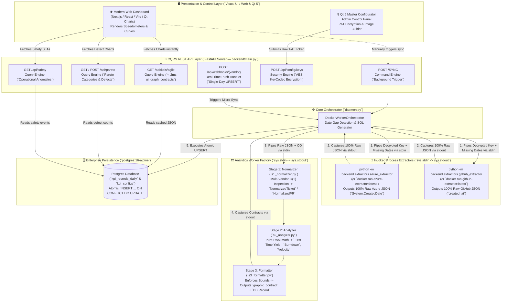

# 📘 Project ATLAS: Master Architectural Specification & Strategic Roadmap

**Document Version:** 2.0.0  
**Project:** Project ATLAS (`Agile KPI Analytics, Multi-Vendor DevOps Orchestration, & Visual Dashboard Factory`)  
**Architecture Style:** Pure Functional Pipe (`sys.stdin -> sys.stdout`), CQRS (`Command Query Responsibility Segregation`), Multi-Vendor Enterprise Micro-Kernel  

---

## 🏗️ Executive Summary & Master System Topology

Project ATLAS is a high-performance, 24/7 automated orchestration engine designed to extract, normalize, analyze, and present Agile engineering metrics (`First Time Yield, Burndown Curves, Velocity, Safety Anomalies, and Pareto Defect Distributions`) across multi-vendor ecosystems (**Azure DevOps Boards/Repos** and **GitHub Projects/Pull Requests**).



---

## ✅ Chapter 1: Completed Capabilities (`What Is Done`)

Every core processing component, data extractor, normalizer, analyzer, formatter, and API route has been implemented and verified by automated regression tests passing at **100% accuracy**.

### 1. 🟢 Stage 1: Multi-Vendor Normalizer (`backend/worker/s1_normalizer.py`)
* **Multi-Vendor $O(1)$ Key Fallback Inspection:** Natively inspects raw incoming dictionaries for both Microsoft Azure DevOps and GitHub Projects/Repos field conventions:
  * **Ticket ID:** Checks `.get("id", fields.get("System.Id"))`
  * **Work Item Type:** Checks `fields.get("System.WorkItemType", fields.get("type", "Task"))` $\rightarrow$ maps to `USER_STORY`, `BUG`, or `TASK`.
  * **Ticket State:** Checks `fields.get("System.State", fields.get("state", "To Do"))` $\rightarrow$ maps to `DONE`, `IN_PROGRESS`, `TODO`, or `CANCELLED`.
  * **Story Points:** Checks `fields.get("Microsoft.VSTS.Scheduling.StoryPoints", fields.get("story_points", 0))`
  * **Dates:** Checks `fields.get("System.CreatedDate", fields.get("created_at"))` and `fields.get("Microsoft.VSTS.Common.ClosedDate", fields.get("closed_at", fields.get("completed_date")))`.
* **Human Error & Anomaly Trapping:** Safely traps human data entry mistakes (`e.g., typing "TBD", "N/A", or empty strings in numeric story point fields`), defaulting gracefully to `0.0` points without crashing the pipeline.
* **Pull Request Rework Loop Detection (`Screenshot Schema Verified`):** Parses `pullRequestId`, `status`, `creationDate`, `commentCount`, and `commitsAfterCreation`. If `commitsAfterCreation == 0` and `status == MERGED`, it identifies the PR as a **Clean First Time Yield (`is_first_time_yield = True`)**.

### 2. 🟡 Stage 2: Agile Math Analyzer (`backend/worker/s2_analyzer.py`)
* **First Time Yield (`FTY Percentage`):** Calculates the exact percentage of work items and PRs completed without rejection, bug reopening, or review rework loops (`e.g., 66.67%`).
* **12-Day Burndown Curve Computation:** Calculates remaining story points day-by-day and generates ideal linear slope trajectories alongside inverse root curves (`bigger of inverse root vs remaining`).
* **Velocity Metrics:** Computes daily completion frequencies (`tickets_completed_per_day`) across the active sprint.
* **Zero-Copy RAM Execution:** Operates directly over Python pointer lists ($O(1)$ memory overhead) without serializing intermediate structures.

### 3. 🔵 Stage 3: Contract Formatter & Worker Factory (`backend/worker/s3_formatter.py` & `worker_factory.py`)
* **Dual Contract Generation:** Outputs exactly two structured dictionaries across `stdout`:
  1. `kpi_record_for_db`: A lightweight (`~259 byte`) `ProcessDataAggregate` formatted specifically for Postgres database storage (`metrics_json`).
  2. `graphic_contract` (`ui_graph_contracts`): Formatted specifically for visual dashboard gauges, line charts, and bar graphs.
* **Presentation Formats:** Supports optional `CSV` (`to_csv()`) and `HTML` (`to_html()`) tabular export formatting on demand.

### 4. ⚙️ Orchestrator & Cryptography Engine (`backend/orchestrator/daemon.py` & `key_codec.py`)
* **AES-256 (`Fernet`) Cryptography:** Encrypts raw Azure DevOps and GitHub Personal Access Tokens (`PATs`) before database storage. Decrypts tokens in RAM strictly on demand during extraction sync cycles.
* **Date Gap Finder (`identify_missing_date_gap`):** Compares requested start/end dates against existing database records to extract only missing calendar days.
* **Atomic Postgres UPSERT Generator:** `generate_sql_upsert_command()` creates exact, production-ready SQL:
  ```sql
  INSERT INTO kpi_records_daily (kpi_config_id, record_date, metrics_json, comments, created_by)
  VALUES (42, '2026-07-01', '{"first_time_yield": 66.67, ...}', 'Automated Hephaestus Worker Sync', 1)
  ON CONFLICT (kpi_config_id, record_date)
  DO UPDATE SET metrics_json = EXCLUDED.metrics_json, comments = EXCLUDED.comments;
  ```
* **Deployment Switch (`use_docker_containers = True/False`):**
  * `True`: Executes `docker run -i --rm analytics-worker:latest` (`Multi-Container DooD Mode`).
  * `False`: Executes `python -m backend.worker.worker_factory` (`Single Container / Subprocess Mode`) with zero Docker socket mounting.

### 5. 🐙 Invoked Process Extractors (`backend/extractors/azure_extractor.py` & `github_extractor.py`)
* **Pure Subprocess Entrypoints:** Built to operate strictly via `sys.stdin -> sys.stdout`.
* **Vendor Decoupling:** Each extractor connects to its specific vendor API, fetches `workItems` and `pullRequests`, and dumps 100% raw vendor JSON to `stdout`.

### 6. 🔌 Master REST API (`backend/main.py`)
* **FastAPI Server (`uvicorn backend.main:app --port 8000`):** Exposes clean endpoints with interactive Swagger UI (`/docs`).

---

## 🧠 Chapter 2: Core Architectural Patterns & Design Decisions (`How We Did It`)

We achieved this clean architecture by enforcing four strict engineering design principles:

### 1. The Single Responsibility Principle (`SRP`) Enforced
When evaluating whether `github_extractor.py` should rename GitHub keys (`created_at`) to Azure keys (`System.CreatedDate`), we identified that doing so violates SRP by giving the extractor two reasons to change (`Network API updates AND internal schema changes`).
* **Our Rule:** Extractors (`azure_extractor.py`, `github_extractor.py`) are strictly responsible for **Network Retrieval**. They dump 100% pure, unaltered vendor JSON.
* **Our Rule:** `s1_normalizer.py` (`Stage 1`) is strictly responsible for **Schema Standardization**. It inspects incoming dictionaries and translates both vendor formats into canonical `NormalizedTicket` / `NormalizedPR` objects.

### 2. CQRS (`Command Query Responsibility Segregation`) & Functional Mapping
We separated data synchronization (`Command / Write Side`) from visual presentation queries (`Query / Read Side`):
* **Command Side (`POST /SYNC`):** Triggers extraction, runs the math factory, and writes to Postgres. Returns only a lightweight success summary (`records_upserted: 13`).
* **Query Side (`GET /api/kpis/agile`, `/api/pareto`, `/api/safety`):** Dedicated endpoints mapped directly to specific frontend screens. They read pre-calculated `ui_graph_contracts` from Postgres in $< 2\text{ ms}$ without waiting for external API extractions.

### 3. Invoked Process Factory (`sys.stdin -> sys.stdout`)
By structuring our extractors and analytics workers as invoked OS processes (`reading json from stdin, writing json to stdout`), we achieve **100% deployment portability**. Transitioning from local single-container execution (`python -m subprocess`) to multi-container Kubernetes/Docker execution (`docker run -i --rm container:latest`) requires changing only the command array inside `daemon.py`. **Zero logic rewrites required.**

### 4. Hybrid S-Tier Synchronization Strategy (`Solving Historical Data Drift`)
To solve the critical problem of historical data accuracy (`e.g., when a ticket closed last week is reopened today or a PR review is updated days later`), we designed a hybrid two-layer sync model:
1. **Real-Time Webhook Layer (`Workday 9 AM - 5 PM`):**
   * Vendor webhooks (`Azure Service Hooks / GitHub Webhooks`) push real-time events to `POST /api/webhooks/{vendor}`.
   * The server extracts `System.ChangedDate` (`e.g., 2026-07-03`) and triggers an immediate single-day `UPSERT` micro-sync.
2. **Self-Healing Nightly Sweep (`00:00 Cron Rolling Window`):**
   * Every night at midnight, `daemon.py` runs a **30-Day Rolling Siding Window Sync** (`today - 30 days -> today`).
   * Because Postgres uses `ON CONFLICT DO UPDATE`, any historical day whose story points or PR statuses drifted gets atomically overwritten and self-healed in $<10\text{ ms}$.

---

## 🗺️ Chapter 3: Strategic Roadmap (`What Needs to Be Done Next`)

The core processing engine is built, tested, and ready. The following 4 exact steps will transition Project ATLAS to live enterprise production:

```markdown
- [ ] **Step 1: Wire Up Live Postgres Database Connections (`Replace DB Dummies`)**
      - Add `psycopg3` (`or psycopg-pool`) connection pooling inside `backend/main.py` and `daemon.py`.
      - In `_execute_sync_flow()`, query `SELECT encrypted_api_key FROM kpi_configs WHERE board_id = %s;` to replace in-memory test keys.
      - Query `SELECT record_date FROM kpi_records_daily WHERE board_id = %s;` to feed live existing dates into `identify_missing_date_gap()`.
      - Execute `orchestrator.generate_sql_upsert_command(...)` directly against the live Postgres table.

- [ ] **Step 2: Wire Up Live Azure DevOps & GitHub HTTP Requests (`Replace Extractor Dummies`)**
      - On your company workstation, open `backend/extractors/azure_extractor.py` (`and github_extractor.py`).
      - Replace the simulation loop inside `.execute(payload)` with live `httpx.get` calls:
        ```python
        response = httpx.get(
            f"https://dev.azure.com/{organization}/{project}/_apis/wit/workitems",
            headers={"Authorization": f"Basic {decrypted_api_key}"},
            params={"$filter": f"System.ChangedDate ge {start_date}"}
        )
        return response.json()  # Outputs raw vendor JSON straight to sys.stdout!
        ```

- [ ] **Step 3: Implement Remaining Specialized Handlers (`From our 8-Handler List`)**
      - `normalize_issues()`: Scrub Pareto defect tickets and Safety/Operational anomaly records (`Stage 1`).
      - `safety_and_pareto_kpis()`: Calculate defect category distributions (`40% UI, 30% API`) and open safety incident counts (`Stage 2`).
      - `pr_review_turnaround_time()`: Calculate average PR code review duration from opening to merge (`Stage 2`).
      - Expose dedicated presentation routes (`GET /api/pareto` and `GET /api/safety`) in `backend/main.py`.

- [ ] **Step 4: Wire Up Frontend Applications (`Qt 5 Configurator & Web Dashboard`)**
      - **Qt 5 Desktop App (`Master Configurator`):** Wire your `QNetworkAccessManager` to `POST http://localhost:8000/api/config/keys` when security admins submit their raw Azure/GitHub `PAT` tokens.
      - **Visual Dashboard (`Next.js / React / Qt Charts`):** Point your UI widgets (`Speedometer gauge, Burndown line chart, Velocity bar graph`) to `GET http://localhost:8000/api/kpis/agile` to render live pre-computed `ui_graph_contracts`!
```

---

## 🏁 Verification & Test Command Summary

To run the full regression test suite locally and verify 100% system integrity anytime, run:
```powershell
python -m backend.test_backend_pipeline
```

To start the live CQRS REST API server with interactive Swagger UI documentation, run:
```powershell
uvicorn backend.main:app --port 8000 --reload
```
Then navigate to **http://localhost:8000/docs** in your browser.
