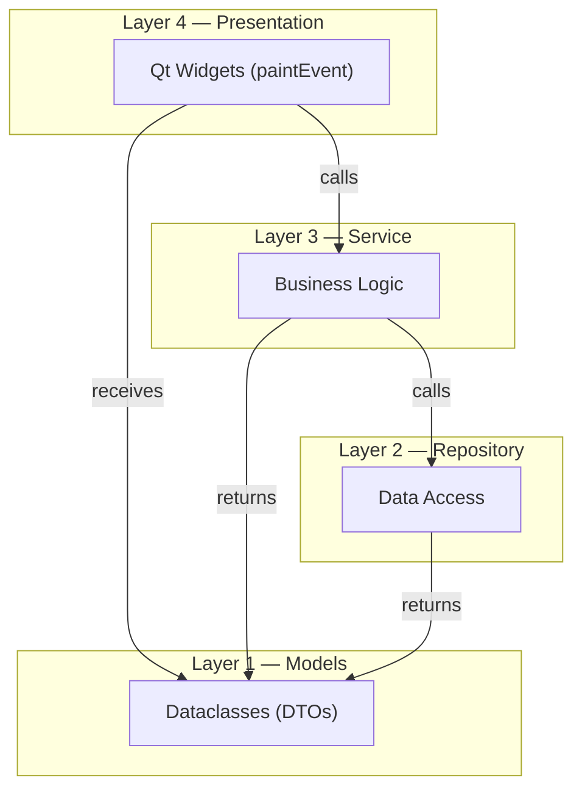
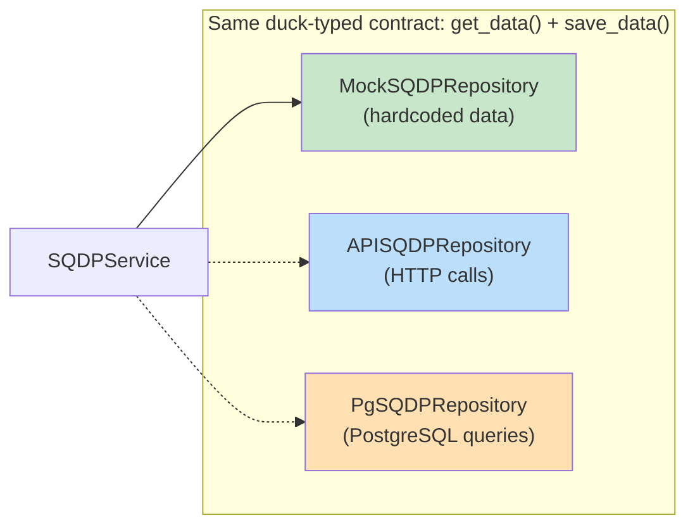
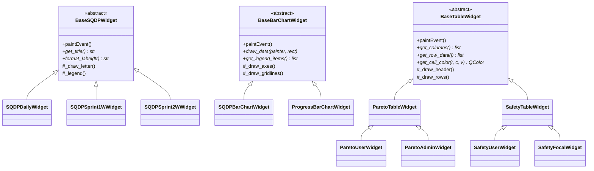
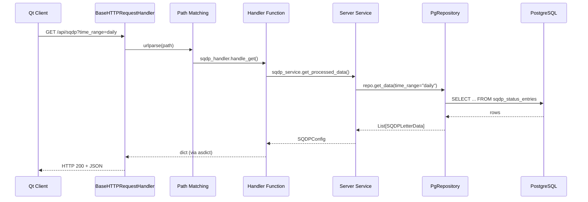
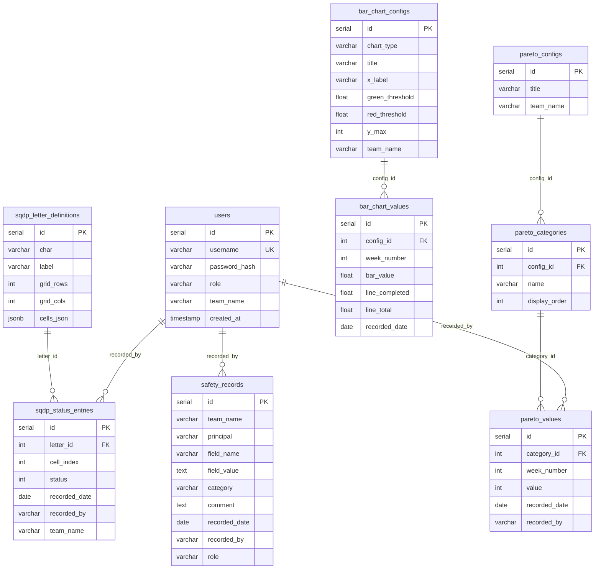
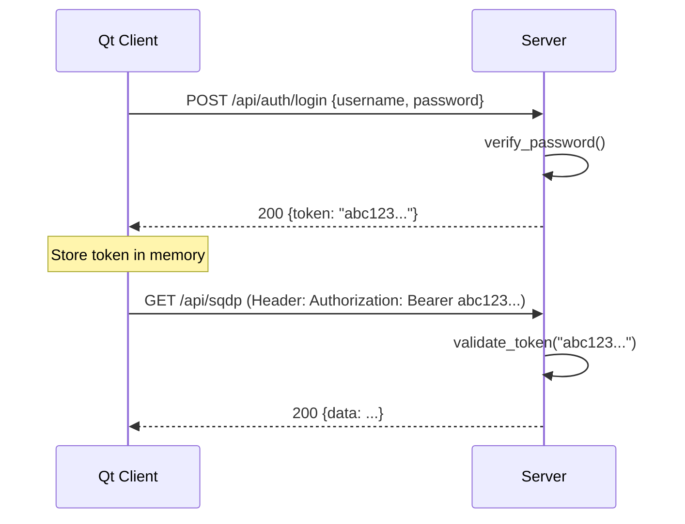
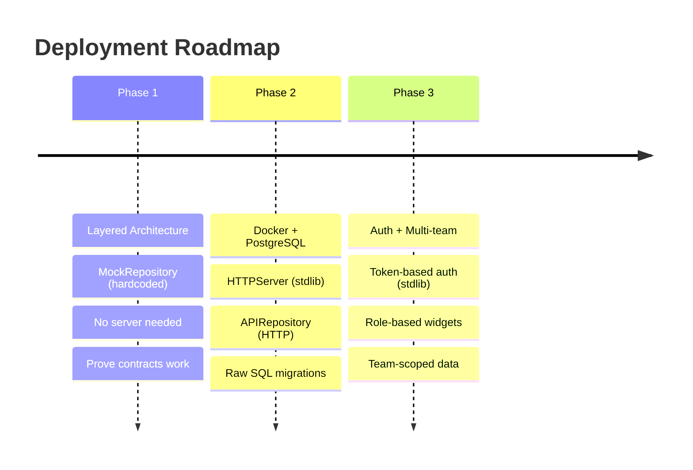

# WOR Dashboard — Architecture Reference

Pure architecture specification. No UI/widget details — only the structural patterns, layers, contracts, data flow, and deployment.

---

## 1. Architectural Patterns Applied

| Pattern | What It Means Here |
|---|---|
| **Layered Architecture** | Code is organized into 4 strict layers. Each layer only talks to the one directly below it — never skips. |
| **Contract-Based Programming** | Layer boundaries are enforced by **type hints** + **try/except**. Any class with the right methods satisfies the contract (duck typing). No ABCs. |
| **Service-Repository** | Repositories handle *where* data comes from. Services handle *what* to do with it. Presentation handles *how* to show it. |
| **Dependency Injection** | Objects receive their dependencies via constructor parameters, never by creating them internally. |

---

## 2. Layer Diagram



### Layer Rules

> [!CAUTION]
> **Strict dependency direction.** A layer may only import from the layer directly below it or from Layer 1 (Models). Presentation must **never** import from Repository. Service must **never** import from Presentation.

| Layer | May Import From | Must NOT Import From |
|---|---|---|
| Presentation | Service, Models | Repository |
| Service | Repository, Models | Presentation |
| Repository | Models | Service, Presentation |
| Models | Python stdlib only | Everything else |

---

## 3. Contracts (Duck Typing + Type Hints + Try/Except)

No ABCs. No `contracts/` folder needed. The "contract" is simply: **if your class has `get_data()` and `save_data()` methods, it's a valid repository.** Python's duck typing handles the rest, and `try/except` catches mistakes at runtime.

### Repository Contract (by convention)

Every repository must have these two methods. No base class to inherit from — just follow the pattern:

```python
class MockSQDPRepository:
    """Any class with get_data() and save_data() is a valid repository."""

    def get_data(self, **filters) -> list:
        """
        Retrieve data from the underlying source.

        Common filters (keyword args):
          - time_range: "daily" | "sprint_1w" | "sprint_2w"
          - team: str
          - role: "user" | "focal" | "admin"
          - chart_type: "sqdp" | "progress"
          - table_type: "pareto" | "safety"
        """
        return [...]  # hardcoded demo data

    def save_data(self, data) -> bool:
        """Persist data. Returns True on success."""
        return True
```

### Service Contract (by convention)

Every service takes a repository in its constructor and exposes `get_processed_data()`.
The `try/except` block is the safety net — if the repo is missing a method or returns bad data, the service handles it gracefully:

```python
class SQDPService:
    """Business logic layer. Receives any object that has get_data()."""

    def __init__(self, repository) -> None:
        self._repo = repository

    def get_processed_data(self, **params) -> any:
        try:
            raw = self._repo.get_data(**params)
            # ... apply business logic, aggregations, filtering ...
            return processed_data
        except AttributeError as e:
            # Repository doesn't have the expected method
            print(f"[SQDPService] Repository contract violation: {e}")
            return None
        except Exception as e:
            # Any other failure (network, DB, bad data)
            print(f"[SQDPService] Error: {e}")
            return None
```

> [!TIP]
> **Why this is better for a dashboard:** If the SQDP data fails to load, the `try/except` returns `None`, and the widget can show a "No data" placeholder. The other 3 widgets (bar chart, pareto, safety) keep working. With ABCs, one bad class crashes the entire app at import time.

### How duck typing enables swapping



Switching from mock to API to Postgres is a **one-line change** in the entry point:

```python
# Phase 1 — offline development
repo = MockSQDPRepository()

# Phase 2 — connected to server
repo = APISQDPRepository(api_client)

# Direct DB (server-side only)
repo = PgSQDPRepository(db_connection)

# Service doesn't know or care which one it gets
# Duck typing: if it has get_data(), it works
service = SQDPService(repo)  # same line regardless
```

### Error handling pattern across all layers

```python
# ── Repository: catches DB/network errors ──
class APISQDPRepository:
    def get_data(self, **filters) -> list:
        try:
            response = self._client.get("/api/sqdp", params=filters)
            return response.json()
        except Exception as e:
            print(f"[APISQDPRepo] Failed to fetch: {e}")
            return []

# ── Service: catches repo failures ──
class SQDPService:
    def get_processed_data(self, **params):
        try:
            raw = self._repo.get_data(**params)
            if not raw:
                return None
            return self._transform(raw)
        except Exception as e:
            print(f"[SQDPService] Error: {e}")
            return None

# ── Presentation: catches service failures ──
class SQDPDailyWidget(BaseSQDPWidget):
    def paintEvent(self, event):
        try:
            if self.data is None:
                self._draw_no_data(painter)
                return
            self._draw_letters(painter)
        except Exception as e:
            print(f"[SQDPWidget] Paint error: {e}")
```

---

## 4. Model Layer (Data Transfer Objects)

Models are `@dataclass` objects that flow **upward** through the layers. They replace raw `Dict[str, Any]` with typed, documented structures.

```python
from dataclasses import dataclass, field, asdict
from typing import List, Tuple, Dict, Any

# ── SQDP ──────────────────────────────────────────
@dataclass
class SQDPLetterData:
    char: str                          # "S", "Q", "D", "P"
    label: str                         # "Safety", "Quality", etc.
    rows: int                          # Grid height
    cols: int                          # Grid width
    cells: List[Tuple[int, int]]       # Coordinates forming the shape
    status: List[int]                  # 1 = green, 0 = red

@dataclass
class SQDPConfig:
    letters: List[SQDPLetterData]
    time_range: str                    # "daily", "sprint_1w", "sprint_2w"


# ── Bar Charts ────────────────────────────────────
@dataclass
class BarChartData:
    title: str
    x_label: str
    categories: List[int]              # X-axis labels (week numbers)
    values: List[float]                # Bar heights
    green_threshold: float
    red_threshold: float

@dataclass
class ProgressChartData:
    title: str
    x_label: str
    categories: List[int]
    bar_values: List[int]              # Blue bars (weekly counts)
    line_completed: List[int]          # Solid line (cumulative actual)
    line_total: List[int]              # Dashed line (cumulative target)
    y_max: int


# ── Tables ────────────────────────────────────────
@dataclass
class ParetoData:
    title: str
    column_headers: List[int]          # Week numbers
    row_categories: List[str]          # Loss category names
    values: List[List[int]]            # 2D grid [row][col]
    averages: List[float]              # Final column

@dataclass
class SafetyData:
    title: str
    fields: List[str]
    principal: str
    values: Dict[str, Any]
    categories: List[str]
    comments: List[str]
```

> [!TIP]
> **Serialization for free.** Every dataclass supports `dataclasses.asdict(obj)` to convert to a dict, which can be directly passed to `json.dumps()` for the API layer. No serialization library needed.

---

## 5. Dependency Injection Flow

The entry point (`dashboard.py`) is the **composition root** — the only place where concrete classes are instantiated and wired together.

```python
# ═══════════════════════════════════════════════════
# dashboard.py — Composition Root
# ═══════════════════════════════════════════════════

USE_API = False  # Flip to True when server is deployed

# Step 1: Create repositories
if USE_API:
    api_client = APIClient(base_url="http://server:5000")
    sqdp_repo  = APISQDPRepository(api_client)
    chart_repo = APIBarChartRepository(api_client)
    table_repo = APITableRepository(api_client)
else:
    sqdp_repo  = MockSQDPRepository()
    chart_repo = MockBarChartRepository()
    table_repo = MockTableRepository()

# Step 2: Inject repositories into services
sqdp_service  = SQDPService(sqdp_repo)
chart_service = BarChartService(chart_repo)
table_service = TableService(table_repo)

# Step 3: Ask services for data (returns model objects)
sqdp_data    = sqdp_service.get_processed_data(time_range="daily")
bar_data     = chart_service.get_processed_data(chart_type="sqdp")
combo_data   = chart_service.get_processed_data(chart_type="progress")
pareto_data  = table_service.get_processed_data(table_type="pareto")

# Step 4: Pass models to widgets
sqdp_widget   = SQDPDailyWidget(sqdp_data)
bar_widget    = SQDPBarChartWidget(bar_data)
combo_widget  = ProgressBarChartWidget(combo_data)
pareto_widget = ParetoTableWidget(pareto_data)
```

---

## 6. Class Inheritance Hierarchy



### What subclasses override

| Base Class | Hook Method | Purpose |
|---|---|---|
| `BaseSQDPWidget` | `get_title()` | Returns "Daily SQDP", "Sprint 1W", etc. |
| `BaseSQDPWidget` | `format_label(ltr)` | Customizes per-letter label text |
| `BaseBarChartWidget` | `draw_data(p, rect)` | Renders bars, lines, or combo |
| `BaseBarChartWidget` | `get_legend_items()` | Defines legend entries |
| `BaseTableWidget` | `get_columns()` | Column headers for this variant |
| `BaseTableWidget` | `get_row_data(i)` | Data values for row `i` |
| `BaseTableWidget` | `get_cell_color(r, c, v)` | Conditional cell highlighting |

---

## 7. Server Architecture (stdlib + Docker)

### Technology Stack

| Concern | Solution | Package |
|---|---|---|
| HTTP Server | `http.server.ThreadingHTTPServer` | stdlib |
| Request Routing | `urllib.parse.urlparse` + path matching | stdlib |
| JSON Serialization | `json` module | stdlib |
| Authentication | `hashlib.sha256` + `secrets.token_hex` | stdlib |
| Database Driver | `psycopg2` | **only external dep** |
| Containerization | Docker + docker-compose | — |
| Database | PostgreSQL 16 | — |

### Server Request Lifecycle



### Docker Composition

```yaml
version: '3.8'

services:
  db:
    image: postgres:16-alpine
    container_name: wor_postgres
    restart: unless-stopped
    ports:
      - "5432:5432"
    environment:
      POSTGRES_DB: ${POSTGRES_DB:-wor_dashboard}
      POSTGRES_USER: ${POSTGRES_USER:-wor_user}
      POSTGRES_PASSWORD: ${POSTGRES_PASSWORD:-changeme}
    volumes:
      - pgdata:/var/lib/postgresql/data
    healthcheck:
      test: ["CMD-SHELL", "pg_isready -U ${POSTGRES_USER:-wor_user}"]
      interval: 5s
      retries: 5

  api:
    build: .
    container_name: wor_api
    restart: unless-stopped
    ports:
      - "5000:5000"
    environment:
      DATABASE_URL: postgresql://${POSTGRES_USER:-wor_user}:${POSTGRES_PASSWORD:-changeme}@db:5432/${POSTGRES_DB:-wor_dashboard}
      SECRET_KEY: ${SECRET_KEY:-change-this-in-production}
    depends_on:
      db:
        condition: service_healthy

volumes:
  pgdata:
```

### What Goes Into the Docker Image

```text
Docker image (server only)         Client machine (Qt app)
┌──────────────────────────┐       ┌──────────────────────────┐
│  models/                 │  ←shared→  models/              │
│  server/                 │       │  repositories/mock/      │
│    ├── app.py            │       │  repositories/api/       │
│    ├── handler.py        │       │  services/               │
│    ├── handlers/         │       │  presentation/           │
│    ├── repositories/     │       │  dashboard.py            │
│    ├── services/         │       └──────────────────────────┘
│    └── migrations/       │
│  requirements.txt        │
│    (psycopg2 only)       │
└──────────────────────────┘
```

> [!IMPORTANT]
> `models/` is the **only shared code** between client and server. It contains zero dependencies — just dataclasses.

---

## 8. PostgreSQL Schema

### Entity Relationship Diagram



### Key Indexes

| Table | Index | Purpose |
|---|---|---|
| `sqdp_status_entries` | `(recorded_date)` | Fast daily/sprint queries |
| `sqdp_status_entries` | `(team_name)` | Team-scoped filtering |
| `bar_chart_values` | `(config_id, week_number)` | Chart data lookups |
| `pareto_values` | `(category_id, week_number)` | Table cell lookups |
| `safety_records` | `(team_name, recorded_date)` | Team + date filtering |

---

## 9. Authentication (stdlib only)

No JWT libraries. Token-based auth using `hashlib` + `secrets`:

```python
import hashlib
import secrets
from typing import Optional, Dict

# In-memory token store (production: move to DB or Redis)
_active_tokens: Dict[str, dict] = {}

def hash_password(password: str) -> str:
    """Hash a password for storage."""
    salt = secrets.token_hex(16)
    hashed = hashlib.sha256((salt + password).encode()).hexdigest()
    return f"{salt}${hashed}"

def verify_password(password: str, stored: str) -> bool:
    """Verify a password against a stored hash."""
    salt, hashed = stored.split("$")
    return hashlib.sha256((salt + password).encode()).hexdigest() == hashed

def create_token(user_id: int, role: str, team: str) -> str:
    """Generate a session token."""
    token = secrets.token_hex(32)
    _active_tokens[token] = {
        "user_id": user_id, "role": role, "team": team
    }
    return token

def validate_token(token: str) -> Optional[dict]:
    """Returns user info if token is valid, None otherwise."""
    return _active_tokens.get(token)
```

### Auth Flow



---

## 10. Deployment Phases



| Phase | Client Repo | Server | Database | Auth |
|---|---|---|---|---|
| **1** | `MockRepository` | None | None | None |
| **2** | `APIRepository` | `ThreadingHTTPServer` | PostgreSQL 16 | None |
| **3** | `APIRepository` | `ThreadingHTTPServer` | PostgreSQL 16 | `hashlib` + `secrets` |

---

## 11. Directory Structure (final)

```text
TestGE/
│
├── docker-compose.yml
├── Dockerfile
├── .env
│
├── dashboard.py                          # Composition root (DI wiring)
│
│                                         # No contracts/ folder needed
│                                         # Duck typing replaces ABCs
│
├── models/                               # Layer 1: DTOs
│   ├── __init__.py
│   ├── sqdp_model.py
│   ├── bar_chart_model.py
│   └── table_model.py
│
├── repositories/                         # Layer 2: Client-side
│   ├── __init__.py
│   ├── mock/                             # Phase 1
│   │   ├── __init__.py
│   │   ├── mock_sqdp_repository.py
│   │   ├── mock_bar_chart_repository.py
│   │   └── mock_table_repository.py
│   └── api/                              # Phase 2+
│       ├── __init__.py
│       ├── api_client.py
│       ├── api_sqdp_repository.py
│       ├── api_bar_chart_repository.py
│       └── api_table_repository.py
│
├── services/                             # Layer 3
│   ├── __init__.py
│   ├── sqdp_service.py
│   ├── bar_chart_service.py
│   └── table_service.py
│
├── presentation/                         # Layer 4
│   ├── __init__.py
│   ├── theme.py
│   ├── sqdp/
│   ├── charts/
│   └── tables/
│
└── server/                               # Dockerized backend
    ├── __init__.py
    ├── app.py
    ├── config.py
    ├── auth.py
    ├── handler.py
    ├── handlers/
    ├── repositories/
    ├── services/
    └── migrations/
        └── 001_initial_schema.sql
```
